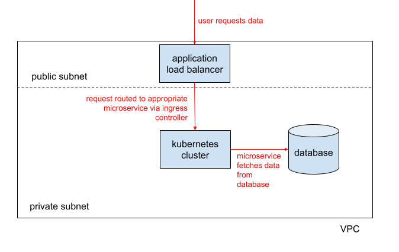

# GA4GH Reference Cloud: Software Design Document (SDD)

* Project Title: GA4GH Reference Cloud
* Project Maintainers:
  * GA4GH Technical Team
    * Jeremy Adams (jeremy.adams@ga4gh.org)
    * Dashrath Chauhan (dashrath.chauhan@ga4gh.org)
    * Jimmy Payyappilly (jimmy.payyappilly@ga4gh.org)
    * Chen Chen (chen.chen@ga4gh.org)
* Start Date: June 1st, 2026

## Context & Background

The Global Alliance for Genomics and Health (GA4GH) unites an international community dedicated to advancing human health through genomic data. We build technical standards and policy frameworks and tools that will expand responsible, voluntary, and secure use of genomic and other related health data.

Since its inception, GA4GH has released a suite of technical standards enabling secure access of genomic data across distributed systems and networks, including **API specifications** and **specifications for managing researcher identities and permissions**. Each standard is designed to be interoperable with one another, such that multiple standards can be used in concert to enable complex researcher workflows involving federated compute and analysis.

## High-Level Summary

Here we propose the development of a **GA4GH Reference Cloud (refcloud)**, led by the GA4GH staff technical team and supported by contributions from the wider expert community. The refcloud will act as a reference implementation of multiple GA4GH standards, providing both researchers and implementers with a working model of how our standards interoperate.

We will host the refcloud as a live service so that users can register for an account, obtain access to open datasets, explore data formatted to standardized data models, and potentially run small, proof-of-concept analyses, all according to standardized APIs and process flows. As an open-source software project, we will provide the entire codebase for anyone who may wish to run the refcloud in their own compute environment, for their own datasets and projects.

# Scope & Requirements

## Goals

* Provide a teaching tool and **interactive model** for common standards-based workflows enabled by GA4GH, such as:
  * Researcher login and obtaining Passport for use in downstream analyses
  * Obtaining data via Data Repository Service (DRS), htsget, and refget
  * Running bioinformatics workflows via WES and TES
  * etc.
* Support standards development efforts (e.g. hackathons) by providing a demo implementation of in-development/trial-use features that are strongly desired by the Work Streams and Subgroups.
* Assist in real-world use cases (identified through GIF, communities of interest, etc.) where possible.

## Non-Goals

The GA4GH reference cloud:

* will not guarantee turn-key production readiness or regulatory compliance. Implementers are welcome to extend the codebase if they wish.
* will focus on implementing approved GA4GH standards, not on drafting new protocol specifications. Trial-use features in existing GA4GH standards may be developed in the refcloud for testing and demo purposes.

# Architecture & System Design

## System Overview

At a high level, the following compute resources are needed to host the GA4GH Reference Cloud:
  * A **virtual private cloud (VPC)** with both public and private subnets to contain/isolate resources
  * A **relational database instance** for persistent storage of application data
  * A **kubernetes cluster** to run the suite of services that together consitute the refcloud
  * An **application load balancer** to route internet traffic to the kubernetes cluster

The GA4GH Tech Team will host the refcloud on AWS, meaning that the core AWS technologies involved are:
* VPC
* RDS (PostgreSQL)
* EKS
* ALB

However, these technologies have their equivalents in the other major cloud providers. As such, implementers should be able to adapt the refcloud for other environments (e.g. Azure, GCP)

### Request Flow

When an external user makes an HTTP request to the reference cloud, the request will first arrive at the application load balancer, whereupon it will be passed to the ingress controller of the kubernetes cluster. The ingress controller will evaluate the request and attempt to match it with the correct service (evaluations will be done using subdomain and/or URL paths). If a matching service has been found, it will receive and handle the request. The service may need to fetch data from its database before responding to the client/user.

A simplified system architecture for the reference cloud is displayed below (request/data flow highlighted in red).

## Data Storage & Modeling

As shown above, the refcloud requires a **single PostgreSQL database instance** to store application state. However, since we are following a microservice design pattern, the database instance will be segregated into multiple logical databases. Some services will connect to their own logical database, others (e.g. the user interface) will not need to connect to a database at all. No database will be shared between multiple services.

As such, the PostgreSQL instance that is used for the reference cloud may also be used for other applications, provided there are no duplicate database/user names.

### Data Storage & Modeling for identity stack

The refcloud will leverage the open source [Ory Stack](https://www.ory.com/) for user identity and access management, in particular [kratos](https://github.com/ory/kratos) and [hydra](https://github.com/ory/hydra). These microservices will each have their corresponding databases within the PostgreSQL instance. Schema migrations will be handled directly by the update tools (docker images) provided by Ory.

### Data Storage & Modeling for core GA4GH models

To ensure relationality and interoperability of all GA4GH data models within the reference cloud, we propose that the entire schema be unified at the database level. This will allow us to create clear relational mappings across all models (e.g. across datasets, files, variants, visas, etc.)

A simplified, initial entity-relationship diagram (ERD) is outlined in the figure below.

ERD explained:
* A **Dataset** serves as a logical container for multiple files, variants, and other data models
* A **Visa** controls access to a dataset. There is a 1-to-1 mapping between datasets and visas. Each visa controls access to only one dataset.
* A **User** is any researcher/implementer registered on the platform. Although most of their profile information will be stored in the kratos db, they also need to be represented here.
* A **UserVisaAssertion** indicates whether a user has been granted a specific visa, and therefore, has access to a specific dataset.
* A **File** represents a file object stored in cloud storage. Files can be accessed through DRS. If they are of a specific file type they may be able to be accessed via specialized genomics APIs (e.g. alignments via htsget, reference sequences via refget)
* A **Variant** represents a genomic variant, represented according to the VRS specification. May be accessible via the Beacon API specification

The above data model is expected to grow as more APIs are incorporated into the reference cloud.

## "Monolith-First" Service Architecture

Considering the following constraints:
* The "reference implementation" nature of the refcloud
* The fact that we want to optimize for all GA4GH data models being related at the database layer
* The relatively small size of the GA4GH Tech Team

We propose that it is most realistic to pursue a **"Monolith-First"** approach, where a single core application acts as the API for all data models. This approach will allow us to avoid development bottlenecks when handling service-to-service communication. As the reference cloud grows and the boundaries between functions becomes more clear, we may shift to a true microservices architecture.

Therefore, the exact suite of services involved in the first phase of the project will be as follows:
* Ory Kratos
* Ory Hydra
* Passport UI Hydra (provides user interface consent screen when minting tokens)
* Reference Cloud API (The "Monolith-First" service, connects to db and serves multiple GA4GH APIs)
* Reference Cloud UI
* Documentation Site

## API / Interface Design

The refcloud will implement the GA4GH APIs as they are prescribed in their original specifications. As such, they will not be re-explained here.

The refcloud production instance will be reachable at https://refcloud.ga4gh.org/ . The following list outlines the planned mapping between standardized API and URL path.

* DRS v1 API: `/ga4gh/drs/v1`

# Technical Implementation & Details

## User Interface

TBD

# Non-Functional Details

TBD

# Operations, Testing, & Rollout

Our devops, version control, testing, and deployment process can be summarized as follows:

* All applications will be version controlled in GitHub
* Devs will use a GitFlow-based branching and merging strategy when doing feature development and bug fixes (feature & fix branches merged into `develop`, which is then merged into `main`)
* GitHub Actions will be used to run automated tests and static analysis of the code
* Once a pull request passes all automated checks and team reviews, branch will be merged into `develop`. This will trigger a push of the docker image to AWS Elastic Container Registry (ECR)
* The refcloud application will be deployed to AWS via **Helm**. The reference cloud helm chart will define all kubernetes resources (deployments, services, etc.) and the correct versions of all services that allows the application to function properly as a whole (i.e. passes all system-level tests)
* System-level tests will be conducted via GitHub Actions (within the repo where the helm chart is defined)
* If system-level tests are passed in GitHub Actions, the latest helm chart release will be deployed in an AWS staging environment, where tests will again be run.
* If system-level tests are passed in the AWS staging environment, the latest helm chart release will be deployed to production.

# Timeline

Please see the [milestones page](https://github.com/ga4gh/ga4gh-reference-cloud/milestones) for project timelines.
